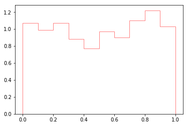
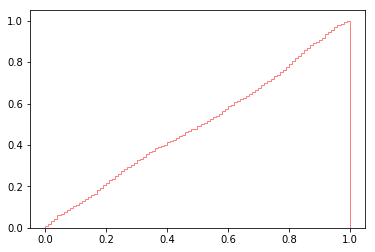

[Think Stats Chapter 4 Exercise 2](http://greenteapress.com/thinkstats2/html/thinkstats2005.html#toc41) (a random distribution)

The distributions do not mirror a uniform distribution, although they reflect a reasonable single observation of a sample of 1000 from an underlying uniform distribution.  I took the point of the question to be to illustrate the randomness in a sample :confused:   

```python
import random
thousand_rands = [random.random() for x in range (0,1000)]
plt.clf()
plt.hist(thousand_rands, density=True, alpha = 0.5, edgecolor = 'r', cumulative = False, histtype = "step", bins = 10)
plt.show()
```


```python
plt.hist(thousand_rands, density=True, alpha = 0.5, edgecolor = 'r', cumulative = True, histtype = "step", bins = 100)
plt.show()
```

